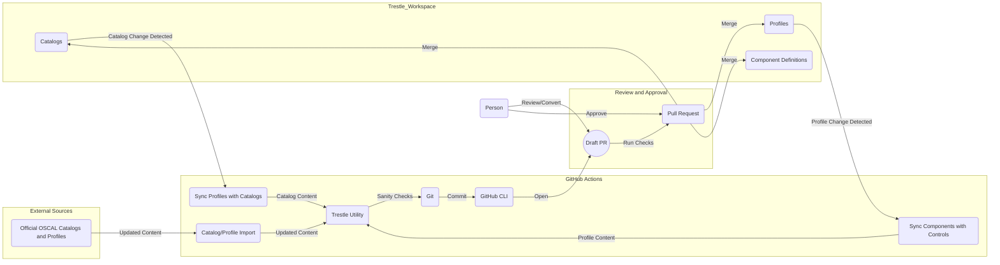

# oscal-component-definitions

OSCAL Component Defintions for testing with FedRAMP HIGH baseline profile.

## Directory Structure

### Content Managed by Automation

Some the directories in this repository are managed through automated processes such as make targets or GitHub Actions.

- catalogs: This stores OSCAL Catalogs installed in the trestle workspace.
- profiles - This stores OSCAL Profiles installed in the trestle workspace.
- vendor - This stores automation managed in a central repository that is vendored in.

For information on how this data is managed, see the [FAQs](./docs/faqs.md).

### Content Managed by Control Provider (i.e. managed directly in this repository)
- markdown - This stores OSCAL Component Definition information that can be edited directly.
- component-definitions - This stores OSCAL Component Definition JSON installed in the trestle workspace.
- scripts - This stores bash scripts for automation tasks unique to this repository.
- data - This stores CSV data that captures OSCAL Component Definition rule information.

## Workflow

The below diagram depict the event-driven pull-based strategy used to update the content in this repository.

To see the available make targets, use `make help`. For information on how to edit the content in this repository, see the [tutorial](./docs/tutorial.md).